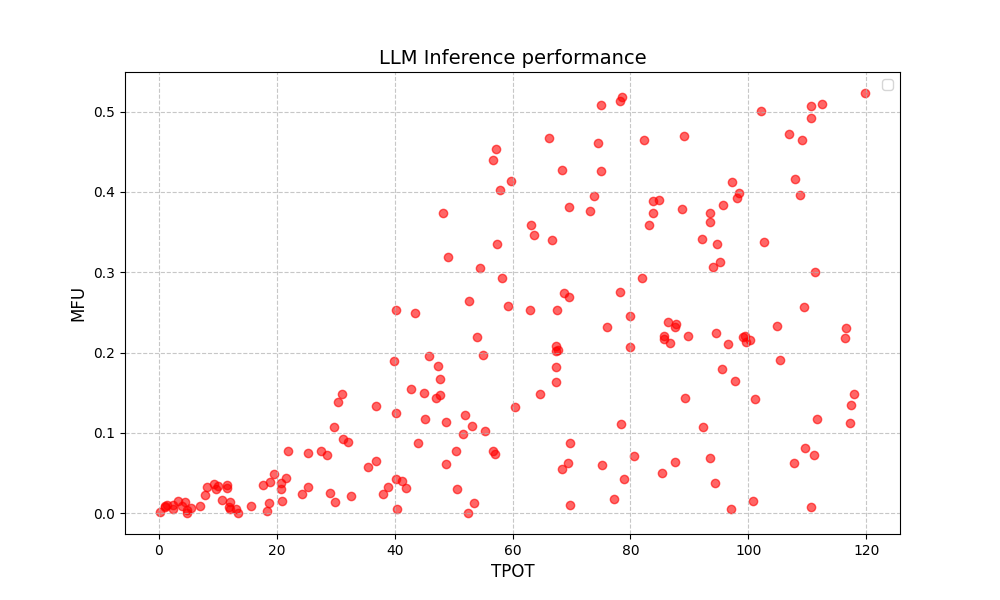
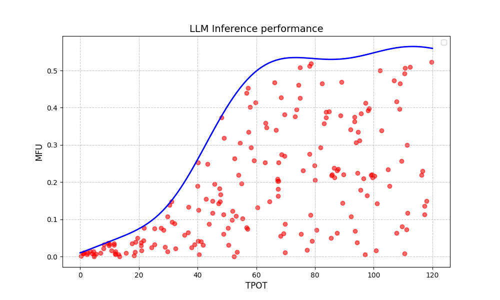
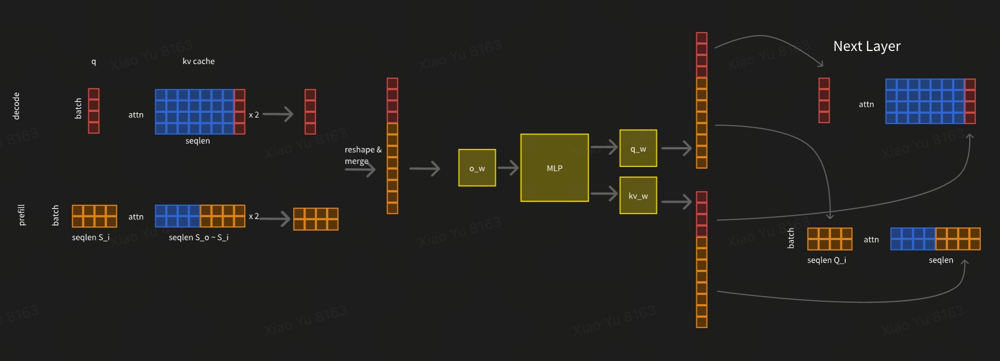
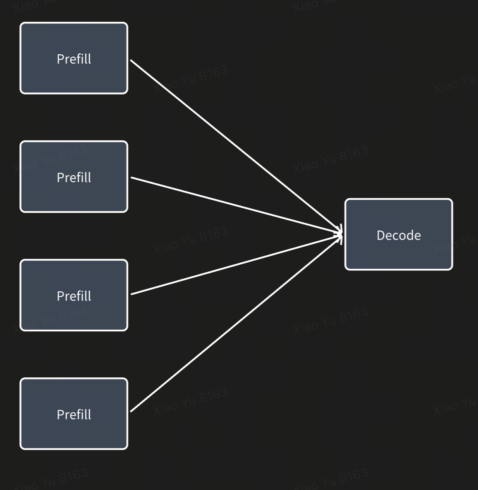
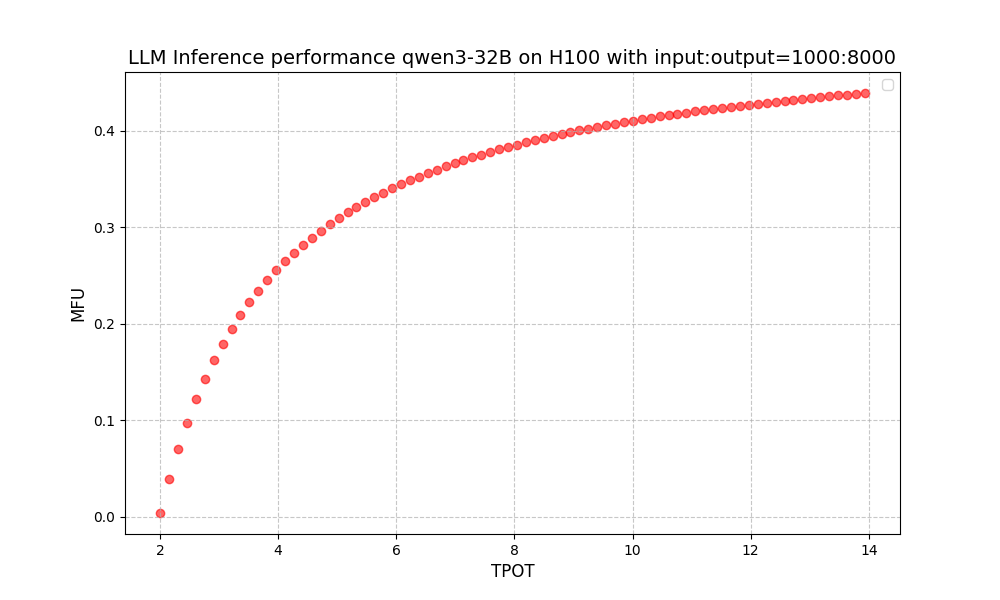

# How to scale LLM inference

## Overview
There are many different configurations for running LLM inference. Each configuration has different latency (TPOT, time per output token) and throughput (MFU, model flops utilization). Each dot in the following diagram represents one configuration:

There are too many different configurations to run benchmarks on all of them and display them in one diagram. Fortunately, we don't need to. Even with these limited examples, we can identify configurations that are strictly better than others: those in the upper-left region. 

For a given model and hardware, there should be a function that takes TPOT as input and returns the optimal MFU. We call this the "optimal TPOT-MFU function for LLM inference". Configurations that can achieve the MFU & TPOT for that function are called optimal configurations.

The goals for LLM inference performance tuning are:
1. Identify the "optimal TPOT-MFU function for LLM inference" (the blue line)
2. Set the TPOT SLA for your LLM inference, and you should be able to get the optimal configuration and optimal MFU.
3. Optimize your LLM inference stack to acheive the optimal MFU.

In this blog, we will show you how to identify the "optimal TPOT-MFU function for LLM inference" (#1) and how to optimize your LLM inference stack to achieve the optimal MFU (#3).

## Notation used in this blog

| Notation | Description |
| --- | --- |
| $B$ | Number of tokens globally |
| $D$ | Hidden size |
| $H_{q}$ | Number of query's attention heads |
| $H_{kv}$ | Number of kv's attention heads |
| $HD$ | Head dimension |
| $L$ | Number of layers |
| $M_{param}$ | Total number of parameters for the model |
| $M_{compute}$ | Number of triggerred parameters for each token. For a dense LLM, $M_{compute} == M_{param}$. For a MOE LLM, $M_{compute} < M_{param}$. |
| $T_{w}$ | Number of bytes for the datatype of weights |
| $T_{kv}$ | Number of bytes for the datatype of kv |
| $Input$ | Input length for a request |
| $Output$ | Output length for a request |
| $QPS$ | QPS per chips |
| $Flops$ | Flops/s for the given hardware |
| $BW$ | HBM bandwidth for the given hardware |
| $W_{nvlink}$ | Nvlink bandwidth for the given hardware |
| $W_{rdma}$ | RDMA bandwidth for the given hardware |
| $P$ | Number of chips with nvlink |

## How to calculate MFU for LLM inference?

There are 2 computationally dense stages in LLMs: MLP and Attention.

| Stage | Required Flops | Required HBM data movement |
| --- | --- | --- |
| MLP | $2 \cdot QPS \cdot (Input+Output) \cdot M_{\text{compute}}$ |  $\frac{2 \cdot QPS \cdot (Input+Output)}{B} \cdot M_{\text{params}} \cdot T_w$ |
| Attn| $2 \cdot QPS \cdot Input \cdot (Input+Output) \cdot H_q \cdot HD \cdot L$ | $QPS \cdot Output \cdot (2 \cdot Input + Output) \cdot H_{kv} \cdot HD \cdot L \cdot T_{kv}$ |

So the MFU of LLM inference is:

$$
MFU = \frac{2 \cdot QPS \cdot (Input+Output) \cdot M_{\text{compute}} + 2 \cdot QPS \cdot Input \cdot (Input+Output) \cdot H_q \cdot HD \cdot L}{\text{flops}}
$$

The following three components can potentially bottleneck LLM inference performance:

### 1. MLP computation (most common)
LLMs have very large $M_{compute}$ and $M_{params}$. In most cases, the MLP component dominates end-to-end performance. To achieve high MFU in this scenario, we need to ensure that computation time exceeds HBM data movement time.

$$
\frac{2 \cdot QPS \cdot (Input+Output) \cdot M_{\text{compute}}}{\text{flops}} > \frac{2 \cdot QPS \cdot (Input+Output) \cdot M_{\text{params}} \cdot T_w}{B \cdot BW}
$$

$$
B > \frac{M_{\text{params}} \cdot T_w \cdot \text{flops}}{2 \cdot M_{\text{compute}} \cdot BW}
$$

The key to performance in this common case is having a good batching strategy to ensure sufficient tokens for computation in each step.

Here is the $B$ for some popular models on the same hardware:

|Hardware|Model|$B$|
| --- | --- | --- |
| H100 | qwen3-32B-w16a16c16| 295|
| H100 | qwen3-32B-w8a8c8| 295|
| H100 | qwen3-30B-A3B-w16a16c16| 2952|
| H100 | qwen3-235B-A22B-w16a16c16| 3154|
| H100 | deepseek-v3-w8a8c8| 6603|

Dense models are relatively easy to achieve high MFU with. However, MoE models are much more challenging since they require a larger number of tokens in each step. Note that the datatype doesn't impact $B$.

Here is the $B$ for the same models on different hardwares:

|Hardware|Model|$B$|
| --- | --- | --- |
| H100 | qwen3-30B-A3B-w16a16c16| 2952|
| H100 | qwen3-30B-A3B-w8a8c8| 2952|
| A100 | qwen3-30B-A3B-w16a16c16| 1560|
| H20 | qwen3-30B-A3B-w16a16c16| 370|
| L40s | qwen3-30B-A3B-w16a16c16| 4190|
| L20 | qwen3-30B-A3B-w16a16c16| 1389|

Among these hardware options, it's easier to achieve high MFU on H20 since it has the highest $BW/Flops$ ratio.

### 2. Attn computation
Attention computation becomes the bottleneck for end-to-end performance when:
$$
2 \cdot QPS \cdot Input \cdot (Input+Output) \cdot H_q \cdot HD \cdot L > 2 \cdot QPS \cdot (Input+Output) \cdot M_{\text{compute}}
$$
$$
Input > \frac{M_{\text{compute}}}{H_q \cdot HD \cdot L}
$$
To achieve high MFU in this case, we need to ensure that attention computation doesn't wait for HBM data movement.
$$
\frac{2 \cdot QPS \cdot Input \cdot (Input+Output) \cdot H_q \cdot HD \cdot L}{\text{flops}} > \frac{QPS \cdot Output \cdot (2 \cdot Input + Output) \cdot H_{kv} \cdot HD \cdot L \cdot T_{kv}}{BW}
$$
$$
Output < Input \cdot \frac{H_q \cdot BW}{H_{kv} \cdot T_{kv} \cdot \text{flops}}
$$
Output needs to be small enough to avoid being bottlenecked by HBM data movement. The ratio between input and output is mainly impacted by $H_{q}/H_{kv}$.

Here are the $Input$ and $Output$ when Attn computation is the bottleneck:

| Hardware | Model | minimum Input length | maximum Output length | input:output ratio |
|--|--|--|--|--|
| H100 | qwen3-32B| 61035| 827| 74|
| H100 | qwen3-32B| 61035| 827| 74|
| A100 | qwen3-32B| 61035| 1565| 39|
| H100 | qwen3-30B-A3B| 15259| 207| 74|
| H20 | qwen3-30B-A3B| 15259| 1650| 9|
| H100 | qwen3-235B-A22B| 28570| 774| 37|
| H100 | qwen3-235B-A22B| 28570| 774| 37|
| H100 | deepseek-v3| 30017| 1627| 18|

We can see that when input length exceeds 15K-60K tokens, attention becomes the bottleneck for end-to-end performance, regardless of hardware or data type. 

| Stage | Computation cost | HBM bandwidth cost |
| --- | --- | --- |
| MLP | $2 \cdot B \cdot M_{\text{compute}} / \text{Flops}$ | $M_{\text{params}} / BW$ |
| Prefill Attn| $4 \cdot Seq_q \cdot Seq_{kv} \cdot H_q \cdot HD \cdot L / \text{Flops}$ | $2 \cdot Seq_{kv} \cdot H_{kv} \cdot HD \cdot L / BW$ |
| Decode Attn| $4 \cdot B \cdot Seq_{kv} \cdot H_q \cdot HD \cdot L / \text{Flops}$ | $2 \cdot B \cdot Seq_{kv} \cdot H_{kv} \cdot HD \cdot L / BW$ |

From the above table, we can see that different stages have varying computational and bandwidth requirements.

### 3. Attention HBM data movement
In long sequence generation, moving KV sequences from HBM to cache can become the bottleneck for end-to-end performance.

$$
\frac{QPS \cdot Output \cdot (2 \cdot Input + Output) \cdot H_{kv} \cdot HD \cdot L \cdot T_{kv}}{BW} > \max\left(\frac{2 \cdot QPS \cdot (Input+Output) \cdot M_{\text{compute}}}{\text{Flops}}, \frac{2 \cdot QPS \cdot Input \cdot (Input+Output) \cdot H_q \cdot HD \cdot L}{\text{Flops}}\right)
$$
$$
Output > \max\left(\frac{M_{\text{compute}} \cdot BW}{H_{kv} \cdot HD \cdot L \cdot T_{kv} \cdot \text{Flops}}, \frac{Input \cdot H_q \cdot BW}{H_{kv} \cdot T_{kv} \cdot \text{Flops}}\right)
$$

From this formula, we can see:
- If $M_{compute}$ is smaller, it's easier to become memory bandwidth bound.

| Hardware | Model | given Input length | Output length |
|--|--|--|--|
| H100 | qwen3-32B-w16a16c16| 10000| 827|
| H100 | qwen3-30B-A3B-w16a16c16| 10000| 207|
| H100 | qwen3-235B-A22B-w16a16c16| 10000| 774|
| H100 | deepseek-v3-w8a8c8| 10000| 1627|

- If the input length is smaller, it's easier to become memory bandwidth bound.

| Hardware | Model | given Input length | Output length |
|--|--|--|--|
| H100 | qwen3-30B-A3B-w16a16c16| 1000| 207|
| H100 | qwen3-30B-A3B-w16a16c16| 10000| 207|
| H100 | qwen3-30B-A3B-w16a16c16| 30000| 406|
| H100 | qwen3-30B-A3B-w16a16c16| 80000| 1084|

- If the hardware has a lower $BW/Flops$ ratio, it's easier to become memory bandwidth bound.

| Hardware | Model | given Input length | Output length |
|--|--|--|--|
| H100 | qwen3-30B-A3B-w16a16c16| 10000| 207|
| H20 | qwen3-30B-A3B-w16a16c16| 10000| 1650|
| L20 | qwen3-30B-A3B-w16a16c16| 10000| 439|
| L40s | qwen3-30B-A3B-w16a16c16| 10000| 146|
| A100 | qwen3-30B-A3B-w16a16c16| 10000| 391|

### Takeaways
- $B$ is critical for achieving high MFU on the MLP part. It is the most important optimization if input and output length are small.
- If the input length exceeds ~60K tokens, attention computation becomes more expensive than the MLP component.
- Even medium output lengths (500-2000 tokens) can make LLM inference memory bandwidth bound.
In the following sections, we will discuss the optimization we can use to mitigate these issues.

## Batching 

As we discussed in the previous section, $B$ is critical for MFU.

There are two stages for LLM inference:
- Prefill: Generate KV cache for the input sequence. In this stage, $B == Input$, so we usually don't need to batch prefill requests.
- Decode: Generate one token per step. In this stage, $B == 1$ for one request per step. We need to batch multiple decode requests together to achieve a high $B$.

Batching the decode stage is challenging since one machine cannot generate enough decode requests by itself. There are typically two approaches to batch decode requests:
- Prefill-decode fusion.
- Prefill-decode disaggregation.

### Prefill-decode fusion
Instead of batching decode requests with other decode requests, we can batch prefill requests with decode requests to collect enough $B$.

In this diagram, $B = \text{prefill_bs} \cdot \text{prefill_chunk} + \text{decode_bs}$.

This way can achieve higher $B$ than batching decode requests with other decode requests. And it is relatively easy to tune:

We know that we can achieve high MFU if $B$ exceeds a threshold for a given model and hardware. If we know the $input:output$ ratio, we can configure:
$$\text{prefill\_chunk} : \text{decode\_bs} = \text{input} : \text{output}$$
$$\text{prefill\_chunk} + \text{decode\_bs} = B = \frac{M_{\text{params}} \cdot T_w \cdot \text{flops}}{2 \cdot M_{\text{compute}} \cdot BW}$$
For example, for Qwen3-32B on H100, $B = 295$. For an application with average input length of 1000 and average output length of 100, the optimal configuration would be $\text{prefill\_chunk} = 268, \text{decode\_bs} = 27$.

### Prefill-decode disaggregation
With this approach, we can run prefill and decode on different machines. A decode machine can receive decode requests from multiple prefill machines to achieve a larger $B$ for the decode stage.

The true power of prefill-decode disaggregation lies in using different chips for each stage (e.g., A100 for prefill, H20 for decode). The ratio between prefill and decode machines can be calculated as:
$$\text{prefill\_machine} : \text{decode\_machine} = \text{input} \cdot \frac{\text{decode\_MFU} \cdot \text{decode\_chip\_flops}}{\text{prefill\_MFU} \cdot \text{prefill\_chip\_flops}} : \text{output}$$

### Comparing two batching strategies
Prefill-decode fusion
- Pros:
  - Easier to deploy
  - Less concurrent requests in one instance. Better for failure recovery.
  - Easier to achieve peak MFU.
- Cons:
  - Usually higher latency since computation resources are shared between prefill and decode.

Prefill-decode disaggregation
- Pros:
  - Can achieve faster latency.
  - Heterogeneous hardware support.
- Cons:
  - Harder to tune and manage the prefill-to-decode ratio.

Peak MFU is similar between these two strategies.

## Speculative decoding

LLM inference can easily become memory bandwidth bound because we need to copy KV cache from HBM to cache in every decode step:
$$\text{total\_size\_to\_move} = Output \cdot (2 \cdot Input + Output) \cdot H_{kv} \cdot HD \cdot L \cdot T_{kv}$$

An effective way to reduce it is to use speculative decoding. Using speculative decoding, we can generate multiple tokens in one decode step, which can significantly reduce the $\text{total\_size\_to\_move}$.
|notation| meaning|
|--|--|
|$AR$| accept ratio of speculative decoding|
|$N$| number of tokens to predict in speculative decoding|

So the expected number of tokens each decoding step can generate is:
$$\text{expected\_tokens\_generated} = \sum_{i=0}^{N} AR^i$$

For example, if $AR=0.7;N=3$, the expected number of tokens each decoding step can generate is:
$$\text{expected\_tokens\_generated} = 0.7^0 + 0.7^1 + 0.7^2 + 0.7^3 = 2.42$$

Then the total size to move from HBM to cache in attention can be reduced to:
$$\text{total\_size\_to\_move} = \frac{Output}{\text{expected\_tokens\_generated}} \cdot (2 \cdot Input + Output) \cdot H_{kv} \cdot HD \cdot L \cdot T_{kv}$$

In addition to reduce memory bandwidth usage, speculative decoding can also reduce the TPOT:
- without speculative decoding: $TPOT = \text{decode\_step\_latency}$
- with speculative decoding: $TPOT = \text{decode\_step\_latency} / \text{expected\_tokens\_generated}$

Note:
- [Guided Generation](https://arxiv.org/abs/2307.09702) is another more constrained approach to reduce memory bandwidth usage.

## Model Parallelism

Model parallelism can split the model into multiple parts and run them on different chips in parallel. There are many different model parallelism strategies. Here we'll use TP (Tensor Parallelism) as an example to analyze the benefits and costs of model parallelism.

Benefits of TP:
- ML hardware has very limited memory capacity (e.g., H100 with 80GB). However, modern LLMs are becoming increasingly large. To fit large models, we can use TP to split model weights across multiple devices.

|Hardware|HBM Capacity|Model|Size of model weight| minimum TP size|
|--|--|--|--|--|
|H100|80GB|Qwen3-32B w16|64GB|1|
|H100|80GB|Qwen3-235B-A22B w16|470GB|8|
|H100|80GB|Deepseek-v3 w8|671GB|16|

- Reduce end-to-end latency through parallel execution.

However, this comes with data communication costs. TP requires all-reduce operations to collect activations from all TP shards at the end of Attention and MLP blocks. The data communication size for TP is:
$$\text{size\_of\_data\_communication} = 4 \cdot B \cdot H \cdot L$$

H100/A100/H20 systems have NVLink high-bandwidth communication across 8 chips. When $TP \leq 8$, we can use NVLink for communication, and the communication cost is:
$$\text{TP\_cost} = \frac{4 \cdot B \cdot H \cdot L}{W_{\text{nvlink}}}$$
When $TP > 8$, we first use RDMA to communicate $1/8$ of the data across the same rank on different machines, then use NVLink to communicate within each machine. The communication cost becomes:
$$\text{TP\_cost} = \frac{4 \cdot B \cdot H \cdot L}{W_{\text{nvlink}}} + \frac{4 \cdot B \cdot H \cdot L}{8 \cdot W_{\text{rdma}}}$$
Since RDMA and NVLink are different communication channels, we can overlap them. The optimized communication cost for $TP > 8$ is:
$$\text{TP\_cost} = \max\left(\frac{4 \cdot B \cdot H \cdot L}{W_{\text{nvlink}}}, \frac{4 \cdot B \cdot H \cdot L}{8 \cdot W_{\text{rdma}}}\right)$$

Note:
- TP for Attention is actually limited by $H_{kv}$, but this limitation can be mitigated by leveraging other model parallelism strategies like SP (sequence parallel).
- In addition to TP, there are many other model parallelism strategies including PP (pipeline parallel), EP (expert parallel), SP (sequence parallel), USP (Ulysses sequence parallel), and CPP (chunk pipeline parallel). Each has different trade-offs. For simplicity, we focus only on TP.
- We can adopt advanced communication computation overlap technique like Flux(https://arxiv.org/html/2406.06858v1) for further improvement.

## Putting everything together

We have discussed the bottlenecks of LLM inference and three key optimization strategies: batching, speculative decoding, and model parallelism. In this section, we'll combine them all to calculate the "optimal TPOT-MFU function for LLM inference".

We will choose to use:
- batching: Prefill-decode fusion
- speculative decoding: $AR=0.7, N=3, \text{expected\_tokens\_generated}=2.42$
- model parallelism: TP using nvlink

We use $B$ as batch size. The number of prefill tokens will be $\frac{B \cdot \text{input}}{\text{input} + \text{output}}$ and the number of decode tokens will be $\frac{B \cdot \text{output}}{\text{input} + \text{output}}$.

| Stage | compute time | HBM bandwidth time | nvlink time |
| --- | --- | --- | --- |
| MLP | $\frac{2 \cdot B \cdot M_{\text{compute}}}{TP \cdot \text{Flops}}$ |  $\frac{M_{\text{params}} \cdot T_w}{TP \cdot BW}$ | $\frac{2 \cdot B \cdot H \cdot L}{W_{\text{nvlink}}}$ |
| Attn| $\frac{2 \cdot B \cdot (Input+Output) \cdot H_q \cdot HD \cdot L}{TP \cdot \text{Flops}}$ | $\frac{B \cdot \text{output} \cdot (2 \cdot Input + Output) \cdot H_{kv} \cdot HD \cdot L \cdot T_{kv}}{(Input + Output) \cdot TP \cdot \text{expected\_tokens\_generated} \cdot BW}$ | $\frac{2 \cdot B \cdot H \cdot L}{W_{\text{nvlink}}}$ |

Please note that we have used some approximations for attention computation and HBM bandwidth.

So the total step time of inference is
$$\text{step\_time} = \max(\text{mlp\_compute\_time} + \text{attn\_compute\_time} + \text{mlp\_nvlink\_time} + \text{attn\_nvlink\_time}, \text{mlp\_hbm\_time} + \text{attn\_hbm\_time})$$
And TPOT is
$$TPOT = \text{step\_time} / \text{expected\_tokens\_generated}$$
And MFU is
$$MFU = \frac{\text{mlp\_compute\_time} + \text{attn\_compute\_time}}{\text{step\_time}}$$

We can write a simple Python program to plot the "optimal TPOT-MFU function for LLM inference". Here's an example:

With this, we understand the roofline performance for LLM inference. We can select a point on the diagram with the expected TPOT for deployment. When actually deploying the model, you may find that performance doesn't meet expectations. There are still many optimizations needed in the LLM serving stack to achieve optimal performance. Here are some important ones to investigate further and their expected impact:
- **Quantization**: Quantization can both accelerate computation and reduce memory bandwidth usage. This blog briefly mentioned int8/fp8 quantization, but the actual quantization techniques are much more complex. Expected impact: 30-70% throughput/latency improvements.
- **Async scheduler**: ML hardware is becoming increasingly fast, and we don't want slow CPU operations to interfere with GPU execution. An async scheduler is critical for allowing the CPU to handle all preparation work ahead of time. Expected impact: 30% throughput improvements.
- **Advanced model parallelism**: TP has limitations, so we need to combine it with other model parallelism strategies to achieve optimal performance. Expected impact: 10% throughput, 2x latency improvements.
- **Heterogeneous hardware**: As mentioned in this blog, prefill-decode disaggregation can leverage heterogeneous hardware. Some model parallelism strategies can also utilize heterogeneous hardware. Using less expensive hardware can significantly reduce the overall cost of LLM inference. Expected impact: 2x cost improvements.