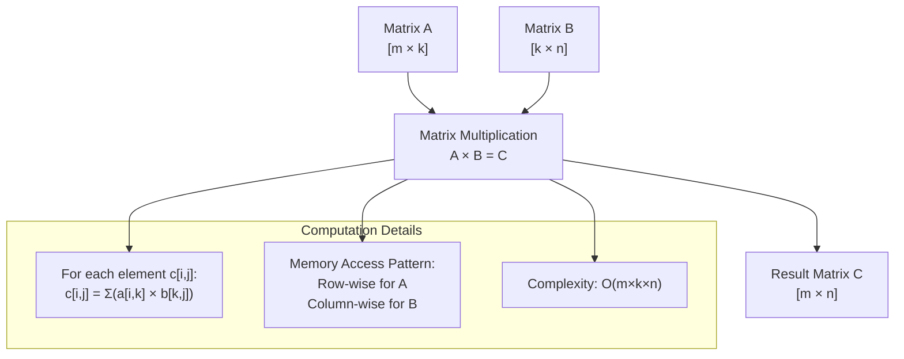
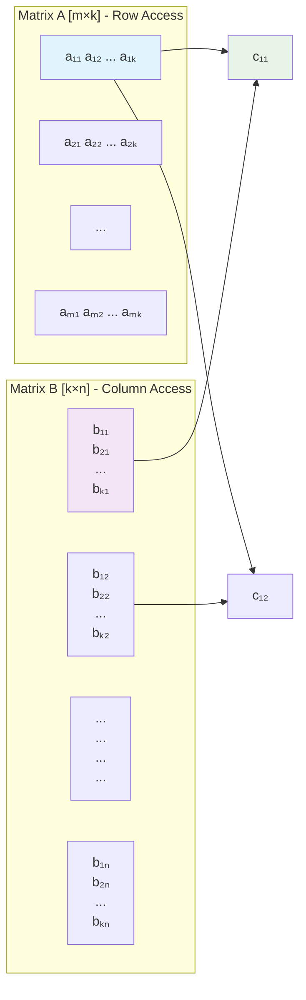

# LLM inference scaling guide

Large Language Model (LLM) inference scaling is crucial for deploying AI applications at scale. This guide covers key strategies and considerations for optimizing LLM inference performance.

## Hardware Considerations

### GPU Selection
- **Memory Requirements**: Ensure sufficient VRAM for model weights and activations
- **Compute Capability**: Higher CUDA cores and tensor cores improve throughput
- **Memory Bandwidth**: Critical for loading model parameters efficiently

### CPU and System Resources
- **CPU Cores**: More cores help with preprocessing and batching
- **System RAM**: Adequate for model loading and intermediate computations
- **Storage**: Fast SSD storage reduces model loading times

## Matrix Multiplication Fundamentals

Understanding matrix multiplication is crucial for LLM inference optimization. Here's the computational flow for matrix multiplication with shapes [m, k] × [k, n]:

### Memory Access Pattern Visualization

This pattern is fundamental to understanding why memory bandwidth and cache efficiency are critical in LLM inference.

## Optimization Strategies

### Model Optimization
- **Quantization**: Reduce precision (FP16, INT8) to decrease memory usage
- **Pruning**: Remove unnecessary parameters while maintaining accuracy
- **Distillation**: Create smaller models that approximate larger ones

### Inference Optimization
- **Batching**: Process multiple requests simultaneously for better throughput
- **KV Caching**: Cache key-value pairs to avoid recomputation
- **Speculative Decoding**: Use smaller models to predict tokens ahead

## Scaling Architectures

### Horizontal Scaling
- **Load Balancing**: Distribute requests across multiple inference servers
- **Auto-scaling**: Dynamically adjust capacity based on demand
- **Geographic Distribution**: Deploy models closer to users

### Vertical Scaling
- **Multi-GPU Setup**: Use multiple GPUs for larger models or higher throughput
- **Pipeline Parallelism**: Split model layers across different devices
- **Tensor Parallelism**: Split tensors across multiple GPUs

## Monitoring and Performance

### Key Metrics
- **Latency**: Time to generate first token and subsequent tokens
- **Throughput**: Requests processed per second
- **Resource Utilization**: GPU, CPU, and memory usage

### Optimization Tools
- **Profiling**: Identify bottlenecks in inference pipeline
- **A/B Testing**: Compare different optimization strategies
- **Continuous Monitoring**: Track performance in production

## Best Practices

1. **Start Simple**: Begin with basic optimizations before complex solutions
2. **Measure First**: Profile before optimizing to identify real bottlenecks
3. **Consider Trade-offs**: Balance latency, throughput, and accuracy
4. **Plan for Growth**: Design architecture that can scale with demand
5. **Monitor Continuously**: Keep track of performance metrics in production

This guide provides a foundation for scaling LLM inference effectively while maintaining performance and cost efficiency.